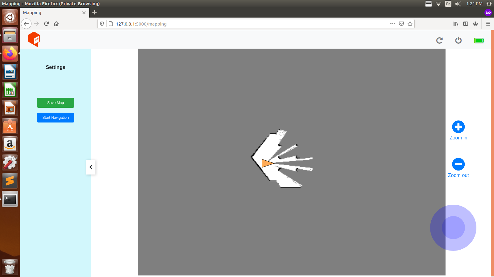
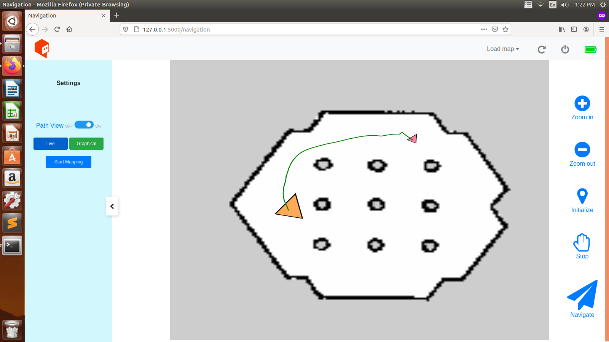

## A web application for Navigation and Mapping ROS

This is a web application that is build on Flask,serves the purpose of Mapping and Navigation of a robot that is build on ROS from a web browser.

## Demo

Mapping:

Navigation:

  See the video: <a href="https://www.youtube.com/watch?v=JoYOW9LRdLY">HERE</a>.

<figure class="video-container">
  <iframe src="https://www.youtube.com/watch?v=JoYOW9LRdLY" frameborder="0" allowfullscreen="true"> </iframe>
</figure>

## Prerequisite

- Robotic Operating System(Kinetic) installed on Ubuntu 16.04
- Runs on python 2.7(Run flask on python 2.7 environment)

## Installation
Here turtlebot3 simulation is used to display the demo.

Run docker file from the main directory,

`sudo docker build .`

`sudo docker run --rm -it --network=host -p 5000:5000 'image ID'`

NOTE:Wait for sometime,if you are loading it for the first time(Gazebo takes some time to load for the first time) 

OR do manual installation as follows,

Clone the following into your src of ros workspace and replace the launch file with the uploaded to view the demo.

- `https://github.com/ROBOTIS-GIT/turtlebot3_msgs.git`

- `https://github.com/ROBOTIS-GIT/turtlebot3`

- `https://github.com/ROBOTIS-GIT/turtlebot3_simulations.git`

open bashrc,

`sudo gedit ~/.bashrc`

place the following at the end,

`source` **path to your ros workspace's setup.bash**  (source /home/rizwin/catkin_ws/devel/setup.bash)

`export TURTLEBOT3_MODEL=waffle`

Install Flask,

`pip install flask`

Install ROS dependecies,

- `sudo apt-get install ros-kinetic-navigation`
- `sudo apt-get install ros-kinetic-slam-gmapping`
- `sudo apt-get install ros-kinetic-rosbridge-suite`
- `sudo apt-get install ros-kinetic-tf2-web-republisher`
- `sudo apt-get install ros-kinetic-robot-pose-publisher`
## Features
- Real time mapping of environment and save the map at same time on browser.
- Zoom,pan,Switch between graphical and live images.
- Real time monitoring of autonomous navigation of robot and its path.
- Load multiple maps and delete from browser.

## Technologies and Languages
  - ROS
  - Python
  - HTML
  - CSS
  - JavaScript
  - Docker
  - sqlite
  - Flask
## Advanced
- You could edit the png file of map located in the static folder to make the map attractive.
- If you are using your own robot write the common nodes in navigation and mapping in one launch file and replace the 

           `subprocess.Popen(["roslaunch", "turtlebot3_navigation", "turtlebot3_bringup.launch"])` 

in **app.py** with the corresponding package and launch file name.Replace your mapping file and navigation file in following,

-          `subprocess.Popen(["roslaunch","--wait", "turtlebot3_navigation",            
            "turtlebot3_navigation.launch","map_file:="+os.getcwd()+"/static/"+mapname+".yaml"])`

-          `subprocess.Popen(["roslaunch", "--wait", "turtlebot3_slam", "turtlebot3_slam.launch"])

# ros_web_app
